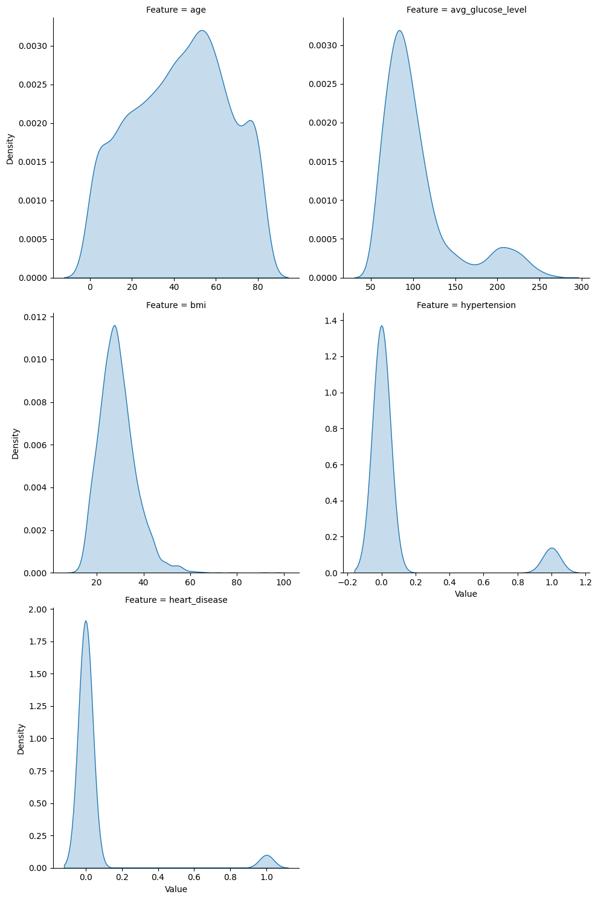
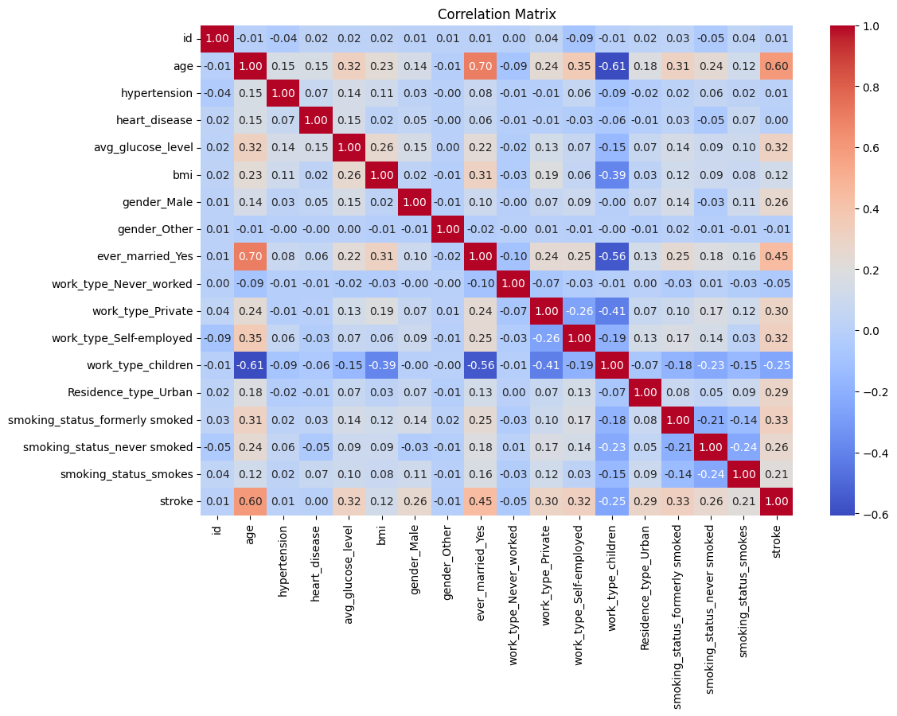
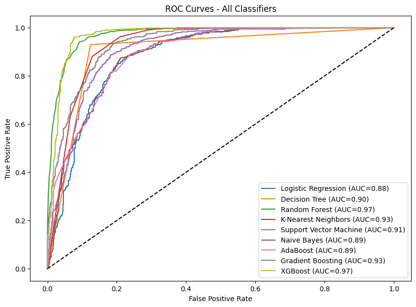
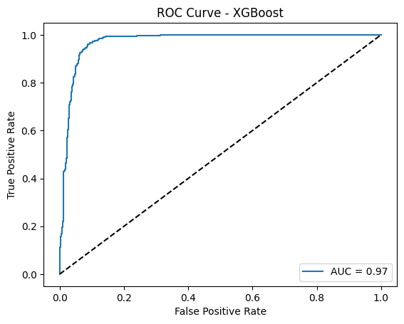
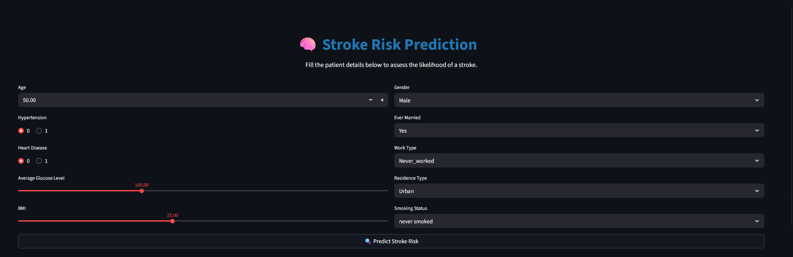
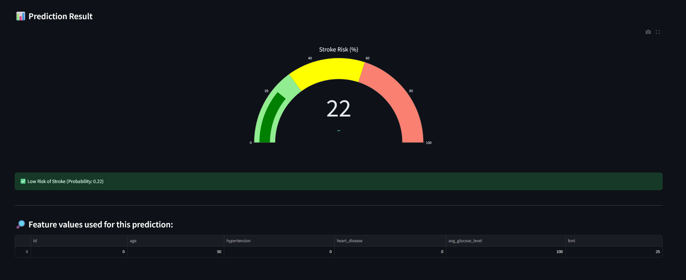

# 🧠 Stroke Prediction Project  

A **Streamlit application** was built for real-time stroke prediction:  

👉 [Live App](https://stroke-prediction-00.streamlit.app/)  

---

## 📖 Introduction  
Stroke is one of the leading causes of death and disability worldwide. Early detection of stroke risk can play a crucial role in preventive healthcare by enabling timely intervention and lifestyle modifications.  

This project aims to **predict the likelihood of stroke occurrence** using healthcare-related factors such as age, hypertension, heart disease, glucose level, BMI, work type, and smoking status.  

We apply **Machine Learning models** and deploy a **Streamlit web app** for real-time predictions.  

---

## 📌 Project Workflow  

1. **Data Preprocessing** – Cleaning, encoding, balancing (SMOTE), scaling  
2. **Exploratory Data Analysis (EDA)** – Visualizations & correlations  
3. **Model Training** – Logistic Regression, Decision Tree, Random Forest, XGBoost  
4. **Model Evaluation** – Accuracy, Precision, Recall, F1, ROC-AUC  
5. **Model Selection** – XGBoost chosen as best performer  
6. **Deployment** – Streamlit app for user interaction  

---

## 📂 Dataset  
- **Source:** Healthcare Stroke Dataset  
- **Target Variable:** `stroke` (1 = stroke occurred, 0 = no stroke)  
- **Features:** Age, Hypertension, Heart Disease, Glucose Level, BMI, Gender, Marital Status, Work Type, Residence Type, Smoking Status  

---

## 🔎 Exploratory Data Analysis (EDA)  

### 📊 Distribution Plots    
  

### 🔥 Correlation Heatmap  
  

---

## 🤖 Model Training & Evaluation  

We trained and compared multiple models:  

| Model               | Accuracy | Precision | Recall | F1 | ROC-AUC |
|----------------------|----------|-----------|--------|----|---------|
| Decision Tree       | 0.9250   | 0.9130    | 0.9426 | 0.9276 | 0.9247 |
| Random Forest       | 0.9564   | 0.9601    | 0.9541 | 0.9571 | 0.9919 |
| Logistic Regression | 0.8840   | 0.8936    | 0.8768 | 0.8851 | 0.9548 |
| **XGBoost**         | **0.9686** | **0.9668** | **0.9718** | **0.9693** | **0.9949** |

### 📈 ROC Curves  
  

---

## 🚀 Deployment – Streamlit App  

### 🖼️ Screenshots  

- **App Home Page**  
    

- **Results Page**  
    

---

## ✅ Conclusion  

This project demonstrates how **machine learning can be applied in healthcare** to identify high-risk stroke patients.  

- **Best Model:** XGBoost (Accuracy 96.8%, ROC-AUC 0.995)  
- **Practical Outcome:** A deployed Streamlit app for patient risk prediction  

This solution can aid healthcare professionals in **early detection and preventive intervention**, potentially saving lives.  

---# Stroke-Prediction
